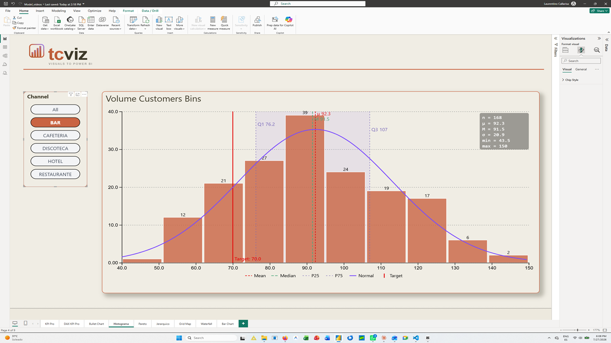
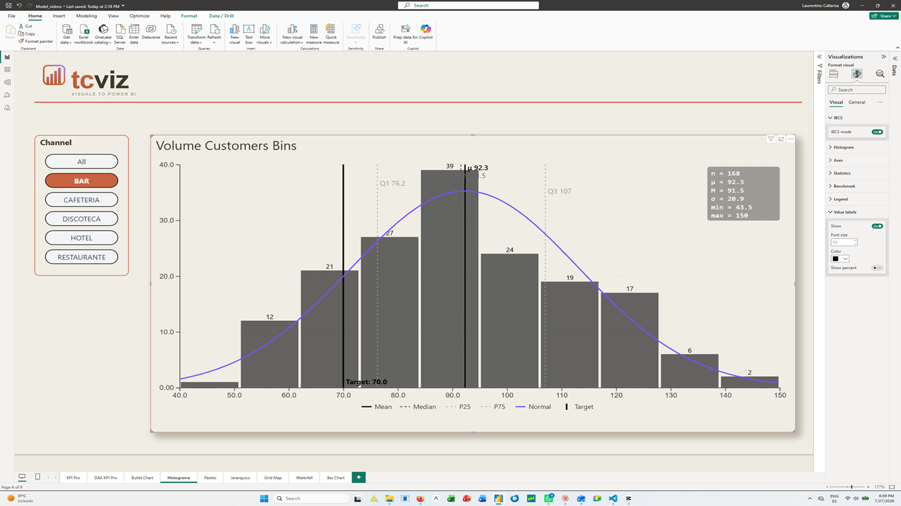

# Histogram Pro

**A Power BI custom visual by [TCViz](https://tcviz.com).**
Turn a numeric field into a real histogram on the report canvas — with the statistical
context needed to read it: mean and median lines, quartiles, IQR shading, a benchmark
line and a normal curve.

**[Get it on Microsoft Marketplace](https://marketplace.microsoft.com/en-us/product/tino_callarisa.histogram-pro-tcviz)** — free tier, no licence required.

[Product page](https://tcviz.com/product/histogram-pro/) ·
[Documentation](https://tinocallarisa-web.github.io/histogram-pro/support.html) ·
[Changelog](CHANGELOG.md) ·
[Video](https://www.youtube.com/watch?v=qL9luDsg3h8) ·
[Report an issue](https://github.com/tinocallarisa-web/histogram-pro/issues)



---

## The problem it solves

An average is a single number standing in for a whole distribution, and it hides
everything that matters about the shape. A mean deal size of $18,000 is consistent with
a pipeline of steady mid-range deals, with hundreds of small ones plus three enormous
outliers, or with two distinct customer segments that never overlap. The card looks the
same in all three cases.

A histogram answers that immediately, and Power BI has no native one. The usual
workaround — pre-binning in the model, a helper table, a column chart dressed up as a
histogram — is rigid, and the bin count stops being something you can think with.

This visual treats the histogram as what it is: an analytical chart, with the bin count
as a control rather than a modelling decision.

Typical uses: deal-size and revenue concentration, cycle and service times, salary
bands, test and survey scores, manufacturing tolerances, claim amounts.

---

## Quick start

1. Drop the visual on the page and put a numeric measure in **Values**.
2. Optionally add a dimension to **Detail (rows)** for row-level data and drilldown.
3. Tune the bin count, overlays and colours in the **Format** pane.

> **The bin count is an analytical choice, not a cosmetic one.** Too few bins flatten a
> bimodal distribution into a single hump; too many turn a clear shape into noise. Start
> around 10–25 and move it until the shape stops changing character — if it keeps
> changing, that instability is itself telling you something about the data.

---

## Field wells

| Field well | Kind | What it does |
|---|---|---|
| **Values** | Measure | The numeric field to distribute. Required. |
| **Detail (rows)** | Grouping | Optional category giving row-level detail. Adding a hierarchy here enables Power BI's drill-up / drill-down controls. |
| **Tooltips** | Measure | Optional extra measures shown on hover, displayed as averages. |

---

## What it does

**Binning and trimming** — set the bin count from 2 to 100, and trim a percentage from
the lower or upper tail. Trimming is there for the common case where a handful of extreme
values stretch the axis until the real mass of the data is squashed into two bars. Use it
to read ordinary behaviour, and say so on the page when you do — a trimmed histogram is a
deliberately partial view.

**Statistical overlays** — mean and median lines, lower and upper quartile markers, and
IQR shading for the middle half of the data. The gap between mean and median is the
fastest read of skew there is: when the mean sits well above the median, something in the
upper tail is pulling it.

**Benchmark line** — a threshold drawn into the chart: a target turnaround time, a
tolerance limit, a policy cutoff. It turns a descriptive chart into an evaluative one,
because the question is usually not "what is the shape" but "how much of it falls on the
wrong side of this line".

**Normal curve overlay** — a reference for how far the distribution departs from a
bell shape. It is an eyeball aid, not a normality test, and is best read as "obviously
not normal" rather than "normal".

**Statistics panel** — n, mean, median, standard deviation, min and max in the corner of
the visual, so an analytical page does not need a row of cards repeating them.

**Formatting** — bar colour, opacity, border and gap; axis and grid styling; value
labels; legend for the active markers; and an **IBCS mode** for teams standardised on
that notation.



---

## Power BI integration

- **Report tooltip pages** — attach your own tooltip page, not just the default tooltip.
- **Drilldown** — a hierarchy in *Detail (rows)* enables the standard drill controls, so
  a company-wide distribution can be opened up by department or region.
- **Conditional formatting** — **Bar color** carries an fx button: colour the bars by a
  rule instead of a constant.
- **Cross-filtering** — select bins to filter the rest of the page; multi-select and
  highlighting behave as Power BI expects.
- **High contrast** — under a Windows high-contrast theme, bars, borders, axes, grid and
  stat lines all take their colours from the theme palette.
- **Keyboard focus** and **landing page** support.

Bookmarks are not supported yet.

---

## Free and Pro

The **free tier** renders a 10-bin histogram with mean and median lines — enough to read
the shape of a distribution and see its skew.

**Pro** unlocks the analytical controls:

- Configurable bins, 2 to 100
- Outlier trimming, lower and upper
- Normal distribution curve overlay
- Full statistics panel (n, μ, M, σ, min, max)
- Value labels on bars
- Custom bar colour, opacity, border and gap

Every install starts with a 30-day Pro trial. No card required.

---

## Documentation and support

- **[Full documentation](https://tinocallarisa-web.github.io/histogram-pro/support.html)** — quick start, field wells, format pane reference and FAQ.
- **[Video walkthrough](https://www.youtube.com/watch?v=qL9luDsg3h8)**.
- **[Issues](https://github.com/tinocallarisa-web/histogram-pro/issues)** — please use the templates; they ask for the bin count, value range and row count, which is what makes a distribution bug reproducible.
- **[Discussions](https://github.com/tinocallarisa-web/histogram-pro/discussions)** — questions and ideas.
- **Licence and billing** — <support@tcviz.com>.

---

## Privacy

The visual makes no network calls. It reads only the data you connect to its field wells,
and its settings are stored in your report file. Licence validation goes through Power
BI's own licensing API. Full detail in the
[privacy policy](https://tinocallarisa-web.github.io/histogram-pro/privacy.html) and the
[terms of use](https://tinocallarisa-web.github.io/histogram-pro/terms.html).

---

## Building from source

```bash
npm install
npx pbiviz package     # production build → dist/
```

Requires the [Power BI Visuals Tools](https://www.npmjs.com/package/powerbi-visuals-tools).
The `certification` branch mirrors what is published to AppSource.
