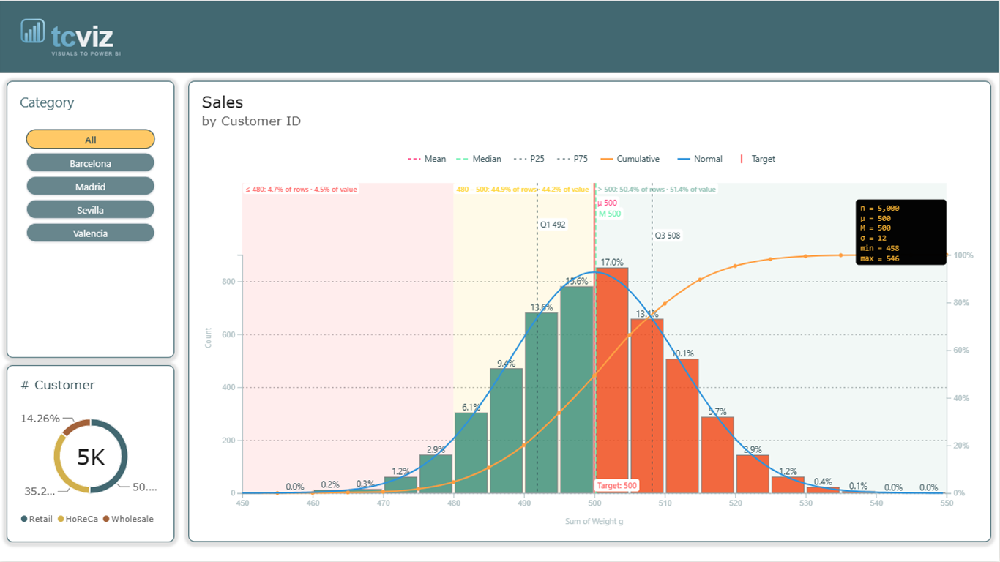
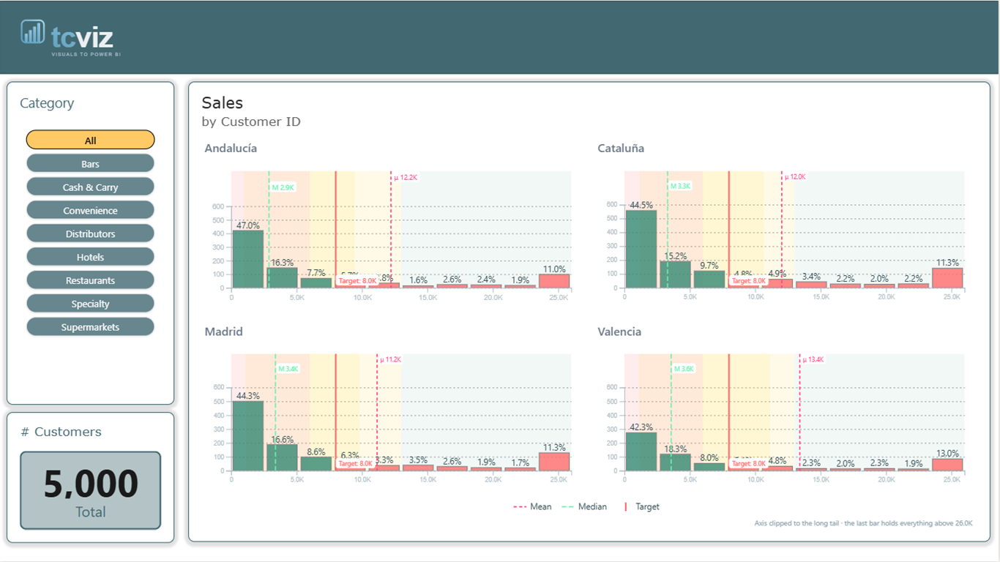

# Histogram Pro

**A Power BI custom visual by [TCViz](https://tcviz.com).**
Turn a numeric field into a real histogram on the report canvas — with the statistical
context needed to read it: mean and median lines, quartiles, IQR shading, a benchmark
line, value zones with the share of rows and of value in each, a cumulative frequency
line, a normal curve — and small multiples to compare groups on the same bins.

**Power BI features supported:** small multiples · conditional formatting (fx) on bar
colour · drilldown · cross-filtering by the whole bar, Ctrl+click multi-select and
highlighting · bookmarks · standard and report page tooltips · context menu · keyboard
navigation with ARIA labels · high contrast · number formats from the model ·
localization (English, Spanish) · IBCS mode · data streaming past 30,000 rows.

**[Get it on Microsoft Marketplace](https://marketplace.microsoft.com/en-us/product/tino_callarisa.histogram-pro-tcviz)** — free tier, no licence required.

[Product page](https://tcviz.com/product/histogram-pro/) ·
[Documentation](https://tinocallarisa-web.github.io/histogram-pro/support.html) ·
[Case study](https://tinocallarisa-web.github.io/histogram-pro/use-case.html) ·
[Changelog](CHANGELOG.md) ·
[Video](https://www.youtube.com/watch?v=elLjSnxd8tw) ·
[Report an issue](https://github.com/tinocallarisa-web/histogram-pro/issues)



---

## The problem it solves

An average is a single number standing in for a whole distribution, and it hides
everything that matters about the shape. A mean deal size of $18,000 is consistent with
a pipeline of steady mid-range deals, with hundreds of small ones plus three enormous
outliers, or with two distinct customer segments that never overlap. The card looks the
same in all three cases.

A histogram answers that immediately, and Power BI has no native one. The usual
workaround — pre-binning in the model, a helper table, a column chart dressed up as a
histogram — is rigid, and the bin count stops being something you can think with.

This visual treats the histogram as what it is: an analytical chart, with the bin count
as a control rather than a modelling decision.

Typical uses: deal-size and revenue concentration, cycle and service times, salary
bands, test and survey scores, manufacturing tolerances, claim amounts.

---

## Quick start

1. Drop the visual on the page and put a numeric measure in **Values**.
2. Optionally add a dimension to **Detail (rows)** for row-level data and drilldown.
3. Tune the bin count, overlays and colours in the **Format** pane.
4. To compare groups, drop a field into **Small multiples** (Pro).

> **The bin count is an analytical choice, not a cosmetic one.** Too few bins flatten a
> bimodal distribution into a single hump; too many turn a clear shape into noise. Start
> around 10–25 and move it until the shape stops changing character — if it keeps
> changing, that instability is itself telling you something about the data.

---

## Field wells

| Field well | Kind | What it does |
|---|---|---|
| **Values** | Measure | The numeric field to distribute. Required. |
| **Detail (rows)** | Grouping | Optional category giving row-level detail. Adding a hierarchy here enables Power BI's drill-up / drill-down controls. |
| **Small multiples** (Pro) | Grouping | One histogram per value, on shared bins and a shared vertical scale. |
| **Tooltips** | Measure | Optional extra measures shown on hover, displayed as averages. |

---

## What it does

**Binning and trimming** — set the bin count from 2 to 100, and trim a percentage from
the lower or upper tail. Trimming is there for the common case where a handful of extreme
values stretch the axis until the real mass of the data is squashed into two bars. Use it
to read ordinary behaviour, and say so on the page when you do — a trimmed histogram is a
deliberately partial view.

**Statistical overlays** — mean and median lines, lower and upper quartile markers, and
IQR shading for the middle half of the data. The gap between mean and median is the
fastest read of skew there is: when the mean sits well above the median, something in the
upper tail is pulling it.

**Benchmark line** — a threshold drawn into the chart: a target turnaround time, a
tolerance limit, a policy cutoff. It turns a descriptive chart into an evaluative one,
because the question is usually not "what is the shape" but "how much of it falls on the
wrong side of this line".

**Value zones** (Pro) — two cut points split the axis into three shaded zones, each
labelled with its share of rows and its share of total value: *"> 50K: 8% of rows · 46%
of value"* says what a histogram only implies — that a few large deals carry half the
revenue.

**Cumulative frequency** (Pro) — a 0–100% line on its own right axis: read across from
80% to find the value 80% of rows stay under.

**Small multiples** (Pro) — one histogram per region, year or segment. All panels share
the bins and the vertical scale, so bars compare across panels; the statistics are
computed per panel.

**Normal curve overlay** — a reference for how far the distribution departs from a
bell shape. It is an eyeball aid, not a normality test, and is best read as "obviously
not normal" rather than "normal".

**Statistics panel** — n, mean, median, standard deviation, min and max in the corner of
the visual, so an analytical page does not need a row of cards repeating them.

**Formatting** — bar colour, opacity, border and gap; axis and grid styling; value
labels; backgrounds for the statistics panel and the labels; legend font, colour and
position; bar colouring by benchmark; and an **IBCS mode** for teams standardised on
that notation.



---

## Power BI integration

- **Report tooltip pages** — attach your own tooltip page, not just the default tooltip.
- **Drilldown** — a hierarchy in *Detail (rows)* enables the standard drill controls, so
  a company-wide distribution can be opened up by department or region.
- **Conditional formatting** — **Bar color** carries an fx button: colour the bars by a
  rule instead of a constant.
- **Cross-filtering** — click a bar to filter the rest of the page by every row behind
  it; Ctrl+click adds bars. The selected bars stay highlighted.
- **Bookmarks** — the selection is stored with the report, so a bookmark restores both
  the filter and the highlighted bars.
- **Number formats and language** — the measure's format string and the report's locale
  are used everywhere; the format pane and chart texts are in English and Spanish.
- **High contrast** — under a Windows high-contrast theme, bars, borders, axes, grid and
  stat lines all take their colours from the theme palette.
- **Keyboard focus** and **landing page** support.

---

## What it handles

| | |
|---|---|
| Rows | **Your whole table.** Power BI hands a visual 30,000 rows at a time; the visual asks for the following segments and combines them. Verified at 500,000. |
| Bins | 10 in Free, **2 to 100** with Pro |
| Cross-filter | **Up to 10,000 distinct values in one click** |
| Tooltips | Up to 10 measures |

Power BI Desktop is the exception on row count: it cannot stream data segments to a
custom visual, so it draws the first 30,000 and says so on the chart. Publish to the
Service for the full distribution.

**The axis is built for skewed data.** Amounts, response times and consumption have long
tails, and an axis running from the minimum to the maximum pushes every other row into the
first bar. The axis focuses on where the data lives instead — and every row is still
counted, with values beyond it going into the end bar and a note saying so.

---

## Free and Pro

The **free tier** is the histogram itself, over your whole dataset, with no watermark and
no row limit of ours: the distribution, mean and median lines, quartiles and IQR shading,
the benchmark line and bar colouring by benchmark, the legend, IBCS mode, axis controls,
cross-filtering, bookmarks, drilldown, keyboard navigation and high contrast.

**Pro** adds the analytical controls:

- Configurable bins, 2 to 100
- Outlier trimming, lower and upper
- Value zones with the share of rows and of value
- Small multiples
- Cumulative frequency line
- Normal distribution curve overlay
- Full statistics panel (n, μ, M, σ, min, max)
- Value labels on bars
- Custom bar colour, conditional formatting (fx), opacity, border and gap

Every install starts with a 30-day Pro trial. No card required.

---

## Documentation and support

- **[Full documentation](https://tinocallarisa-web.github.io/histogram-pro/support.html)** — quick start, reading the chart, field wells, every format setting, accessibility, limits and FAQ, with search.
- **[Case study](https://tinocallarisa-web.github.io/histogram-pro/use-case.html)** — reading a retail sales distribution end to end, from raw spread to the outliers that explained it.
- **[Video walkthrough](https://www.youtube.com/watch?v=elLjSnxd8tw)**.
- **[Issues](https://github.com/tinocallarisa-web/histogram-pro/issues)** — please use the templates; they ask for the bin count, value range and row count, which is what makes a distribution bug reproducible.
- **[Discussions](https://github.com/tinocallarisa-web/histogram-pro/discussions)** — questions and ideas.
- **Licence and billing** — <support@tcviz.com>.

---

## Privacy

The visual makes no network calls. It reads only the data you connect to its field wells,
and its settings are stored in your report file. Licence validation goes through Power
BI's own licensing API. Full detail in the
[privacy policy](https://tinocallarisa-web.github.io/histogram-pro/privacy.html) and the
[terms of use](https://tinocallarisa-web.github.io/histogram-pro/terms.html).

---

## Building from source

```bash
npm install
npx pbiviz package     # production build → dist/
```

Requires the [Power BI Visuals Tools](https://www.npmjs.com/package/powerbi-visuals-tools).
The `certification` branch mirrors what is published to AppSource.
